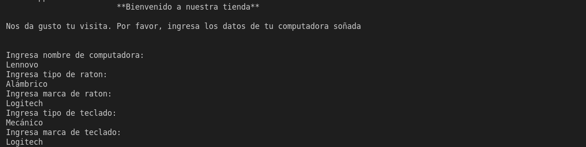

## Proyecto de Herencia
Este proyecto muestra el trabajo realizado en herencia con Java.
Simulamos una tienda en la cual se va ingresando por consola la marca y caractarísticas de nuestra computadora deseada.

### Aviso: 
Todos los datos de tamaño deben ser colocados por número

 
